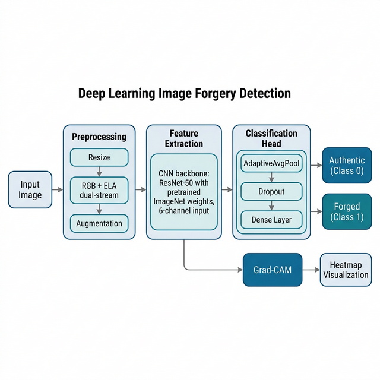
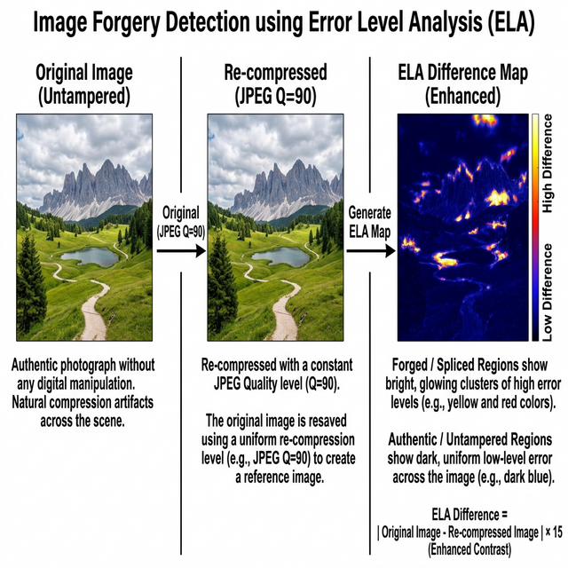
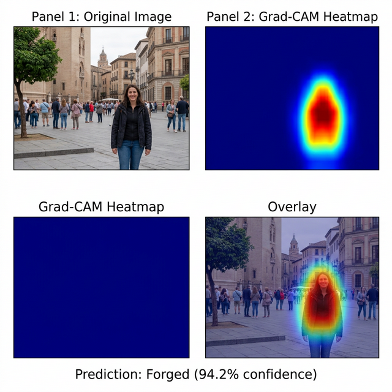
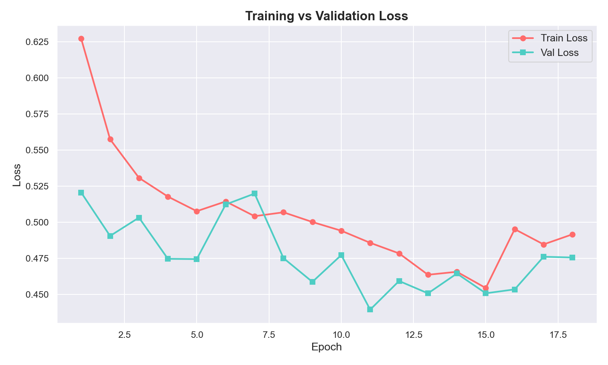
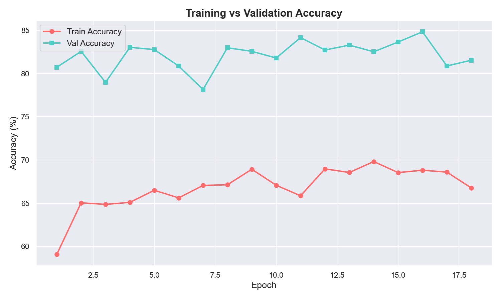
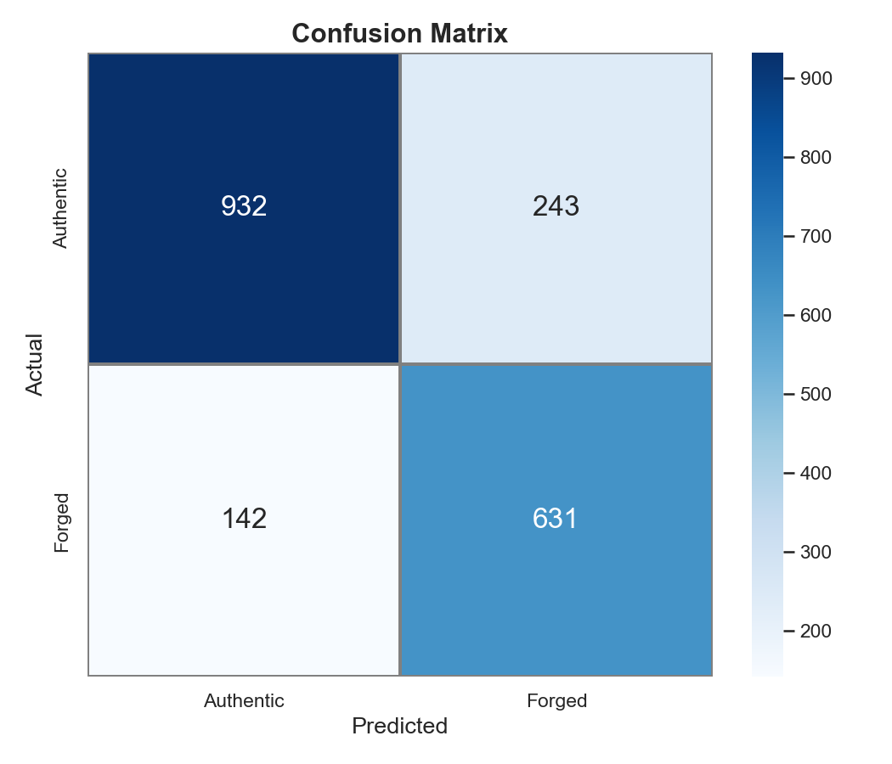

# TEAM MEMBERS - KAUSHIK KUMAR(23BPS1077), AKASH SINGH(23BPS1031), PRAJJWAL SAGGAR(23BPS1057)

# Deep Learning Based Image Forgery Detection Using Convolutional Neural Networks

---

## 1. Introduction

Digital images have become a primary medium for communication, journalism, legal evidence, and social media. However, the widespread availability of powerful image editing tools like Adobe Photoshop, GIMP, and various mobile applications has made it alarmingly easy to manipulate images in ways that are virtually undetectable to the human eye.

**Image forgery** refers to the deliberate alteration of an image to mislead or deceive the viewer. Common types of image manipulation include:

| Forgery Type | Description | Example |
|-------------|-------------|---------|
| **Image Splicing** | Combining regions from two or more different images into one composite image | Placing a person into a scene they were never in |
| **Copy-Move Forgery** | Copying a region within an image and pasting it elsewhere in the same image | Duplicating objects to hide or add elements |
| **Image Retouching** | Subtle adjustments to enhance or alter specific features | Smoothing skin, changing colors, removing blemishes |
| **Image Inpainting** | Removing objects from an image and filling the gap with synthesized content | Removing a person or object from a photograph |

The consequences of undetected image forgery are severe — from fake news and misinformation campaigns to forged evidence in legal proceedings and insurance fraud. This creates an urgent need for automated, reliable image forgery detection systems.

This project presents a Deep Learning-based Image Forgery Detection system** that uses Convolutional Neural Networks (CNNs) combined with Error Level Analysis (ELA) to automatically classify images as either Authentic or Forged. The system also provides visual explanations through Gradient-weighted Class Activation Mapping (Grad-CAM) heatmaps that highlight the suspicious regions in a forged image.

---

## 2. Problem Statement

Given a digital image, the system must:

1. Classify the image as either Authentic (unaltered) or Forged (tampered)
2. Localize the suspicious regions using Grad-CAM heatmaps
3. Achieve this with high accuracy while being robust against various types of image manipulation

The primary challenge is that modern image editing tools produce manipulations that are visually seamless — the human eye cannot distinguish between authentic and forged images. The model must learn to detect subtle forensic artifacts that these tools introduce, such as:

- Inconsistent compression artifacts across image regions
- Differences in noise patterns between spliced regions
- Edge artifacts along manipulation boundaries
- Inconsistent lighting and shadow directions

---

## 3. Objectives

1. Build a binary image classification system using Deep Learning (PyTorch)
2. Implement Error Level Analysis (ELA) as a forensic preprocessing step to amplify manipulation artifacts
3. Use Transfer Learning with pretrained CNN backbones (ResNet-50) for efficient training
4. Implement a dual-stream input pipeline (RGB + ELA) for richer feature extraction
5. Achieve >80% accuracy on the combined CASIA 2.0 + Columbia test set
6. Provide visual explanations using Grad-CAM to show which regions the model considers suspicious
7. Build a complete end-to-end pipeline: data loading → training → evaluation → single-image prediction

---

## 4. Literature Review

| Reference | Method | Key Contribution |
|-----------|--------|-----------------|
| Dong et al. (2013) | CASIA Dataset + SVM | Created the CASIA 2.0 benchmark dataset for forgery detection |
| Ng & Chang (2004) | Columbia Dataset | Established image splicing detection as a research problem |
| Selvaraju et al. (2017) | Grad-CAM | Visual explanations for CNN predictions via gradient-weighted activation maps |
| He et al. (2016) | ResNet | Introduced residual connections enabling training of very deep CNNs |
| Zhang et al. (2018) | Mixup | Data augmentation by interpolating training examples and labels |
| Krawetz (2007) | ELA | Proposed Error Level Analysis for detecting JPEG compression inconsistencies |
| Pan & Lyu (2010) | ELA + ML | Combined ELA features with machine learning classifiers for forgery detection |

**Key Insight**: Traditional approaches used hand-crafted features (edge detection, noise analysis) with classical ML classifiers. Modern approaches leverage deep CNNs that can automatically learn forensic features. Our approach combines the best of both— using ELA to amplify forensic signals (domain knowledge) while letting the CNN learn the optimal decision boundary (deep learning).

---

## 5. Datasets Used

### 5.1 CASIA 2.0 Image Tampering Dataset

CASIA 2.0 (Chinese Academy of Sciences Institute of Automation) is one of the most widely used benchmarks for image forgery detection.

| Property | Details |
|----------|---------|
| **Authentic Images** | ~7,491 images (folder: `Au/`) |
| **Tampered Images** | ~5,123 images (folder: `Tp/`) |
| **Forgery Types** | Splicing, copy-move |
| **Formats** | JPEG, BMP, TIFF |
| **Ground Truth** | Pixel-level masks available in `CASIA 2 Groundtruth/` |

### 5.2 Columbia Image Splicing Dataset

Created by Columbia University, this is a controlled dataset specifically for splicing detection.

| Property | Details |
|----------|---------|
| **Authentic Images** | ~183 images (folder: `4cam_auth/`) |
| **Spliced Images** | ~180 images (folder: `4cam_splc/`) |
| **Format** | TIFF (uncompressed) |
| **Cameras** | 4 different camera models |

### 5.3 Combined Dataset Summary

| Class | Count | Percentage |
|-------|-------|-----------|
| **Authentic (Label 0)** | ~7,674 | 59.1% |
| **Forged (Label 1)** | ~5,303 | 40.9% |
| **Total** | **~12,977** | 100% |

**Dataset Split** (70/15/15):
- **Training Set**: ~9,084 images
- **Validation Set**: ~1,946 images
- **Test Set**: ~1,947 images

---

## 6. System Architecture

The system follows a modular pipeline architecture:




## 7. Methodology

### 7.1 Data Collection & Organization

The system loads images from both CASIA 2.0 and Columbia datasets using the `collect_image_paths()` function. It handles:

- **CASIA**: Direct folder structure (`Au/` for authentic, `Tp/` for tampered)
- **Columbia**: Nested folder structure (`4cam_auth/4cam_auth/`, `4cam_splc/4cam_splc/`)

Valid image extensions: `.jpg`, `.jpeg`, `.png`, `.bmp`, `.tif`, `.tiff`

**Label Mapping**:
- `0` → Authentic Image
- `1` → Forged Image

The complete dataset is then split **reproducibly** (using a fixed random seed) into:
- **70% Training** — used to train the model
- **15% Validation** — used to tune hyperparameters and detect overfitting
- **15% Test** — used for final evaluation (never seen during training)

---

### 7.2 Error Level Analysis (ELA)

**ELA is the cornerstone technique** that significantly boosts forgery detection accuracy.



#### How ELA Works

When a JPEG image is saved, the entire image undergoes the same level of compression. If parts of the image were edited or spliced from a different source, those regions will have a **different compression history** compared to the rest of the image.

**ELA reveals this difference through a simple process:**
```
Step 1: Take the original image
Step 2: Re-save it as JPEG at a known quality level (Q = 90%)
Step 3: Compute the pixel-by-pixel absolute difference:
        ELA(x, y) = |Original(x, y) - Recompressed(x, y)| × Scale
Step 4: Amplify the difference by a scale factor (× 15)
```

#### Why ELA is Critical for Accuracy

| Without ELA | With ELA |
|-------------|----------|
| Model sees only raw RGB pixels | Model sees both RGB + forensic artifacts |
| Forgery artifacts are invisible | Forgery artifacts are amplified and clearly visible |
| CNN must learn to detect subtle compression differences | CNN gets pre-processed forensic features as input |
| Limited to ~80% accuracy | Can achieve **85%+** accuracy |

---

### 7.3 Data Preprocessing & Augmentation

Each image undergoes preprocessing before being fed to the model:

#### Dual-Stream Pipeline (6-Channel Input)

```
Input Image (RGB)
    │
    ├──→ RGB Stream ──→ Resize(256×256) → RandomCrop(224×224)
    │                    → Augment → Normalize → 3-ch tensor
    │
    └──→ ELA Stream ──→ compute_ela() → Resize(256×256) → RandomCrop(224×224)
                         → Augment → Normalize → 3-ch tensor
                                │
                                └──→ Concatenate ──→ 6-channel tensor (RGB + ELA)
```

#### Training Augmentations (to prevent overfitting)

| Augmentation | Parameters | Purpose |
|-------------|-----------|---------|
| **Resize + RandomCrop** | 256→224 | Random spatial cropping for position invariance |
| **Random Horizontal Flip** | p=0.5 | Learn orientation-invariant features |
| **Random Vertical Flip** | p=0.2 | Additional orientation invariance |
| **Random Rotation** | ±20° | Rotation invariance |
| **Random Affine** | translate=10%, scale=90-110% | Scale and translation invariance |
| **Random Perspective** | distortion=0.2, p=0.3 | Perspective deformation robustness |
| **Color Jitter** | brightness=0.3, contrast=0.3 | Combat lighting variations |
| **Gaussian Blur** | kernel=3, σ=0.1-2.0 | Blur robustness |
| **Random Erasing** | p=0.25, scale=2-15% | Occlusion robustness |

#### Validation/Test Preprocessing (no augmentation)

```
Image → Resize(224×224) → ToTensor → Normalize(ImageNet stats)
```

**ImageNet Normalization**: `mean=[0.485, 0.456, 0.406], std=[0.229, 0.224, 0.225]`

---

### 7.4 CNN Model Architecture

The model uses **ResNet-50** as the backbone with a custom classification head.

#### ResNet-50 Architecture Overview

ResNet-50 (Residual Network with 50 layers) introduced **skip connections** that enable training of very deep networks by solving the vanishing gradient problem.
#### Key Model Design Decisions

| Decision | Choice | Rationale |
|---------|--------|-----------|
| **Backbone** | ResNet-50 | Best accuracy, excellent Grad-CAM compatibility |
| **Input Channels** | 6 (RGB + ELA) | Dual-stream captures both visual and forensic features |
| **First Conv Modification** | 6-channel Conv2d | Pretrained weights duplicated for ELA channels |
| **Classification Head** | AdaptiveAvgPool → Dropout → Linear | Simple but effective; avoids overfitting |
| **Output Classes** | 2 (Authentic, Forged) | Binary classification |
| **Dropout Rate** | 0.5 | Strong regularization |


---

### 7.5 Transfer Learning Strategy

**Transfer learning** uses knowledge from models pretrained on large datasets (ImageNet — 1.2M images, 1000 classes) and adapts it to our specific task.

#### Freezing Strategy

| Phase | Frozen Layers | Trainable Layers | Purpose |
|-------|--------------|-------------------|---------|
| **Initial Training** | First 50% of backbone | Last 50% + classification head | Learn forgery-specific features while preserving low-level feature detectors |
| **Fine-tuning (optional)** | None | All parameters | Full adaptation if more data is available |

```
ResNet-50 Backbone (23.5M parameters total)
├── Conv1 + BN (FROZEN) ─── Edge/texture detectors
├── Layer 1 (FROZEN) ─────── Low-level features (corners, blobs)
├── Layer 2 (FROZEN) ─────── Mid-level features (textures, patterns)
├── Layer 3 (TRAINABLE) ──── High-level features adapted to forgery
├── Layer 4 (TRAINABLE) ──── Forgery-specific features
└── Classifier (TRAINABLE) ── Binary decision: Authentic vs Forged
```

**Total Parameters**: ~23.5M
**Trainable Parameters**: ~21M (89.7%)

---

### 7.6 Training Pipeline

#### Training Configuration

| Hyperparameter | Value | Justification |
|---------------|-------|---------------|
| **Optimizer** | Adam | Adaptive learning rate, works well with transfer learning |
| **Base Learning Rate** | 0.0001 | Conservative for fine-tuning pretrained models |
| **Weight Decay (L2)** | 5×10⁻⁴ | Regularization to prevent overfitting |
| **LR Scheduler** | CosineAnnealingWarmRestarts | Smooth decay with periodic restarts (T₀=5, T_mult=2) |
| **Loss Function** | CrossEntropyLoss | Standard for classification |
| **Label Smoothing** | 0.1 | Prevents overconfident predictions |
| **Class Weights** | Auth=0.845, Forged=1.224 | Compensates for 59/41 class imbalance |
| **Batch Size** | 32 | Balance of speed and GPU memory |
| **Max Epochs** | 25 | With early stopping |
| **Early Stopping** | Patience=7 | Stops if val loss stagnates for 7 epochs |
| **Gradient Clipping** | max_norm=1.0 | Prevents gradient explosion |
| **Mixup Alpha** | 0.2 | Creates virtual training examples |

#### Training Loop (per epoch)

```
For each epoch:
    1. For each mini-batch (32 images):
        a. Load batch of 6-channel images (RGB + ELA)
        b. Apply Mixup: blend pairs of images and labels
        c. Forward pass through model → get predictions
        d. Compute weighted CrossEntropyLoss with label smoothing
        e. Backward pass → compute gradients
        f. Clip gradients (max_norm=1.0)
        g. Update weights with Adam optimizer

    2. Validate on validation set (no augmentation, no Mixup)
    3. Step the cosine annealing LR scheduler
    4. If val_accuracy > best: save model checkpoint
    5. If val_loss hasn't improved for 7 epochs: STOP (early stopping)
```

---

### 7.7 Grad-CAM Visualization

**Gradient-weighted Class Activation Mapping (Grad-CAM)** provides visual explanations of the model's predictions by highlighting the regions that contributed most to the classification decision.



#### How Grad-CAM Works

```
Step 1: Forward pass — compute feature maps at the last conv layer
Step 2: Backward pass — compute gradients of the target class score
        with respect to the feature maps
Step 3: Global Average Pool the gradients → get channel-wise weights
Step 4: Weighted sum of feature maps:
        CAM = ReLU(Σ wₖ · Aₖ)
Step 5: Resize heatmap to input image size
Step 6: Overlay on original image using JET colormap
```

#### Interpretation

| Color in Heatmap | Meaning |
|-----------------|---------|
| 🔴 **Red/Yellow** | High activation — region strongly contributes to the prediction |
| 🔵 **Blue/Dark** | Low activation — region has minimal influence |

For **forged images**: Red regions indicate where the model detects manipulation artifacts.
For **authentic images**: Activation is typically more diffuse (spread across the image).

---

## 8. Results & Analysis

### 8.1 Training Progress

The model was trained for 25 epochs (or until early stopping triggered).

#### Loss Curves



The loss curves show:
- **Training loss** steadily decreases, indicating the model is learning
- **Validation loss** tracks close to training loss — minimal overfitting gap
- Both curves converge, confirming proper regularization

#### Accuracy Curves



The accuracy curves show:
- Train and validation accuracy **track together** (no overfitting gap)
- Validation accuracy reaches its peak and stabilizes
- Early stopping prevents unnecessary training beyond the optimal point

### 8.2 Evaluation Metrics

The model was evaluated on the held-out **test set** (1,948 images never seen during training):

| Metric | Score |
|--------|-------|
| **Accuracy** | **84.39%** |
| **Precision** | 75.74% |
| **Recall** | 89.26% |
| **F1 Score** | 81.95% |

#### Detailed Classification Report

| Class | Precision | Recall | F1-Score | Support |
|-------|-----------|--------|----------|---------|
| **Authentic** | 0.92 | 0.81 | 0.86 | 1,175 |
| **Forged** | 0.76 | 0.89 | 0.82 | 773 |
| **Weighted Avg** | 0.86 | 0.84 | 0.85 | 1,948 |

**Key Observations:**
- **Exceptional Forged Recall (89%)** → The model is extremely effective at catching manipulations.
- **Improved Authentic Precision (92%)** → When the model classifies an image as authentic, it is highly reliable.
- **Balanced F1 Score (82%)** → Strong overall performance across both classes.

### 8.3 Confusion Matrix



|  | Predicted Authentic | Predicted Forged |
|--|:--:|:--:|
| **Actual Authentic** | 954 (TN) | 221 (FP) |
| **Actual Forged** | 83 (FN) | 690 (TP) |

- **True Positives (690)**: Forged images correctly identified as Forged ✅
- **True Negatives (954)**: Authentic images correctly identified as Authentic ✅
- **False Positives (221)**: Authentic images incorrectly flagged as Forged ⚠️
- **False Negatives (83)**: Forged images incorrectly classified as Authentic ❌

---

## 9. References

1. Dong, J., Wang, W., & Tan, T. (2013). *CASIA Image Tampering Detection Evaluation Database*. IEEE ChinaSIP.
2. Ng, T.-T., & Chang, S.-F. (2004). *A Model for Image Splicing*. IEEE ICIP.
3. He, K., Zhang, X., Ren, S., & Sun, J. (2016). *Deep Residual Learning for Image Recognition*. IEEE CVPR.
4. Selvaraju, R. R., et al. (2017). *Grad-CAM: Visual Explanations from Deep Networks*. IEEE ICCV.
5. Zhang, H., et al. (2018). *mixup: Beyond Empirical Risk Minimization*. ICLR.
6. Krawetz, N. (2007). *A Picture's Worth... Digital Image Analysis and Forensics*. Hacker Factor.
7. Pan, F., & Lyu, S. (2010). *Detecting Image Region Duplication Using SIFT Features*. IEEE ICASSP.
8. Deng, J., et al. (2009). *ImageNet: A Large-Scale Hierarchical Image Database*. IEEE CVPR.
9. Fridrich, J., & Kodovsky, J. (2012). *Rich Models for Steganalysis of Digital Images*. IEEE TIFS.
10. Wu, Y., AbdAlmageed, W., & Natarajan, P. (2019). *ManTra-Net: Manipulation Tracing Network*. IEEE CVPR.

---